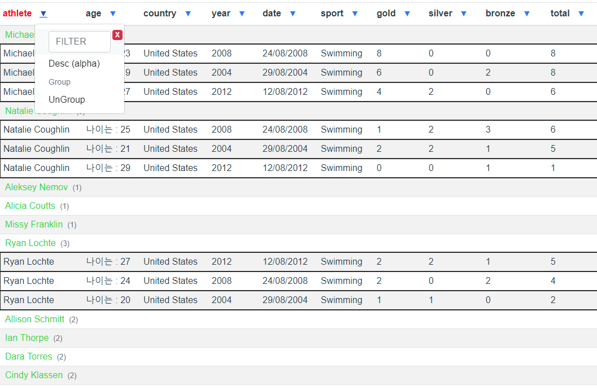

# vue-group-table

> 컬럼별 Group 기능 제공



## Usage

``` bash
npm install vue-group-table
yarn add vue-group-table


# main.js
import BootstrapVue from 'bootstrap-vue'
import 'bootstrap/dist/css/bootstrap.css'
import 'bootstrap-vue/dist/bootstrap-vue.css'
Vue.use(BootstrapVue);
```

# How to use
```html
<group-table :items="items">
    <!-- 확장하고 싶은 컬럼 slot -->
    <template slot="age" slot-scope="row">
        <span>{{ '나이는 : ' + row.value }}</span>
    </template>
</group-table>
```
